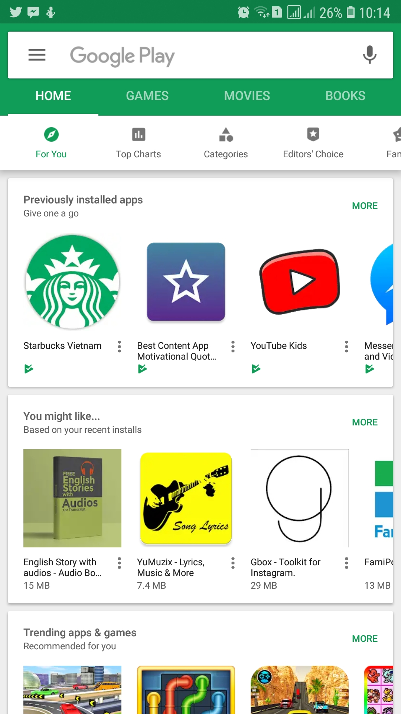

# Nested Recycler View



When the user swipes the side-wise the inner RecyclerView recycles the views and gives you a smooth scroll. But this is not the case when the user scrolls vertically. Each of the views of the inner RecyclerView is inflated again. This is because each of the the nested RecyclerViews has a view pool of its own.

**How to fix**

Setting a single view pool for all the inner RecyclerViews. `RecyclerView.setRecycledViewPool(RecycledViewPool)`

```java
public OuterRecyclerViewAdapter(List<Item> items) {
    //Constructor stuff
    viewPool = new RecyclerView.RecycledViewPool();
}
@Override
public ViewHolder onCreateViewHolder(ViewGroup parent, int viewType) {
    //Create viewHolder etc
    holder.innerRecyclerView.setRecycledViewPool(viewPool);
    
}
```

**Optimization**

* The size of recycler view pool is also configurable `setMaxRecyclerViews(int viewType, int max)`.
* Setting amount of items to prepare in inner RecyclerView (was added in [support library 25.1.0](https://developer.android.com/topic/libraries/support-library/revisions#25-1-0)) with [`LinearLayoutManager.setInitialPrefetchItemCount(int itemCount)`](https://developer.android.com/reference/android/support/v7/widget/LinearLayoutManager#setinitialprefetchitemcount)

    * Set this value to the number of items this inner LayoutManager will display when it is first scrolled into the viewport. RecyclerView will attempt to prefetch that number of items so they are ready, avoiding jank as the inner RecyclerView is scrolled into the viewport.
    
    * For example, take a vertically scrolling RecyclerView with horizontally scrolling inner RecyclerViews. The rows always have 4 items visible in them (or 5 if not aligned). Passing 4 to this method for each inner RecyclerView's LinearLayoutManager will enable RecyclerView's prefetching feature to do create/bind work for 4 views within a row early, before it is scrolled on screen, instead of just the default 2.

---

## Inspiration

Inspired by [Ninad MG](https://proandroiddev.com/@mgn524) and his post about [Optimizing Nested RecyclerView](https://proandroiddev.com/optimizing-nested-recyclerview-a9b7830a4ba7).